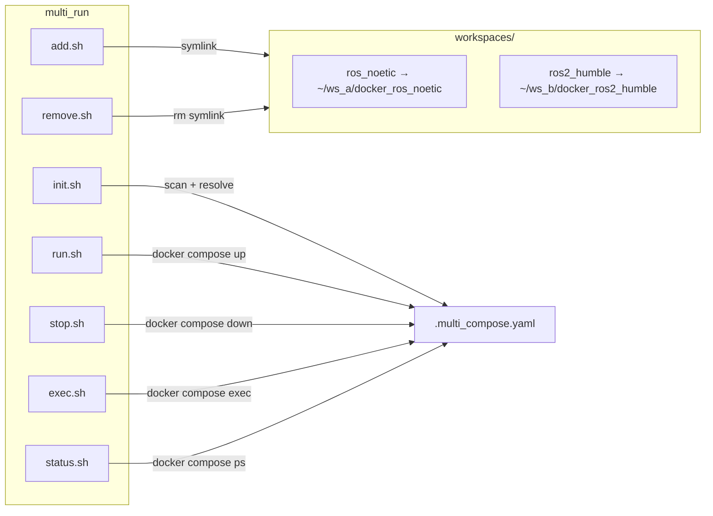

# multi_run

[](https://github.com/ycpss91255-docker/multi_run/actions/workflows/self-test.yaml)


[](./LICENSE)

Launch multiple Docker containers from different workspaces simultaneously.

[繁體中文](doc/readme/README.zh-TW.md) | [简体中文](doc/readme/README.zh-CN.md) | [日本語](doc/readme/README.ja.md)

## TL;DR

```bash
# Add workspaces
./add.sh ~/robot_ws/docker_ros_noetic
./add.sh ~/nav_ws/docker_ros2_humble

# Init + Start
./init.sh && ./run.sh

# Stop
./stop.sh
```

## Overview

Manages multiple [docker_template](https://github.com/ycpss91255-docker/docker_template)-based containers as a single unit. Each workspace's `compose.yaml` is resolved and merged into one compose file with unique service names, enabling simultaneous operation without conflicts.

### Architecture



## Scripts

| Script | Description |
|--------|-------------|
| `add.sh <path>` | Add a workspace (creates symlink in `workspaces/`) |
| `remove.sh <name>` | Remove a workspace |
| `init.sh [path...]` | Generate `.multi_compose.yaml` from workspaces or given paths |
| `run.sh` | Start all containers (`docker compose up -d`) |
| `stop.sh` | Stop all containers (`docker compose down`) |
| `exec.sh <service>` | Exec into a container |
| `status.sh` | Show container status |

## Usage

### Mode 1: Workspace symlinks

```bash
# Add workspaces
./add.sh ~/robot_ws/docker_ros_noetic
./add.sh ~/nav_ws/docker_ros2_humble

# Generate compose + start
./init.sh
./run.sh

# Check status
./status.sh

# Enter a container
./exec.sh ros_noetic_2a8b

# Stop all
./stop.sh
```

### Mode 2: Direct paths

```bash
# Init with paths (skips workspaces/)
./init.sh ~/robot_ws/docker_ros_noetic ~/nav_ws/docker_ros2_humble
./run.sh
```

### Managing workspaces

```bash
# List current workspaces
ls -la workspaces/

# Remove a workspace
./remove.sh ros_noetic
```

## Supported Scenarios

| Scenario | Description | Status |
|----------|-------------|--------|
| Different ws, different repos | `~/ws_a/docker_ros_noetic` + `~/ws_b/docker_ros2_humble` | Tested |
| Same ws, different repos | `~/ws/osrf_ros_noetic` + `~/ws/osrf_ros2_humble` | Tested |
| Different ws, same repo | `~/ws_a/docker_ros_noetic` + `~/ws_b/docker_ros_noetic` | Tested |

## How It Works

1. `init.sh` scans `workspaces/` for symlinks (or takes paths as arguments)
2. For each workspace, runs `docker compose config` to resolve all variables
3. Renames the `devel` service to a unique ID (`{IMAGE_NAME}_{path_hash}`)
4. Merges all resolved services into `.multi_compose.yaml`
5. `run.sh` / `stop.sh` / `exec.sh` / `status.sh` operate on this file

## Running Tests

```bash
make test     # ShellCheck + Bats (via docker compose)
make lint     # ShellCheck only
make help     # Show all targets
```

## Directory Structure

```
multi_run/
├── init.sh                    # Generate merged compose
├── run.sh                     # Start containers
├── exec.sh                    # Exec into container
├── stop.sh                    # Stop containers
├── status.sh                  # Show status
├── add.sh                     # Add workspace
├── remove.sh                  # Remove workspace
├── lib.sh                     # Shared functions
├── workspaces/                # Symlinks to Docker repos
├── Makefile                   # Command entry
├── compose.yaml               # CI runner
├── scripts/
│   └── ci.sh                  # CI pipeline
├── test/
│   ├── multi_run_spec.bats
│   └── test_helper.bash
├── doc/
│   ├── readme/                # README translations
│   ├── test/                  # TEST.md + translations
│   └── changelog/             # CHANGELOG.md + translations
├── .github/workflows/
│   └── self-test.yaml
├── .codecov.yaml
├── .gitignore
├── LICENSE
└── README.md
```

## Changelog

See [CHANGELOG.md](doc/changelog/CHANGELOG.md).

## Tests

See [TEST.md](doc/test/TEST.md).
