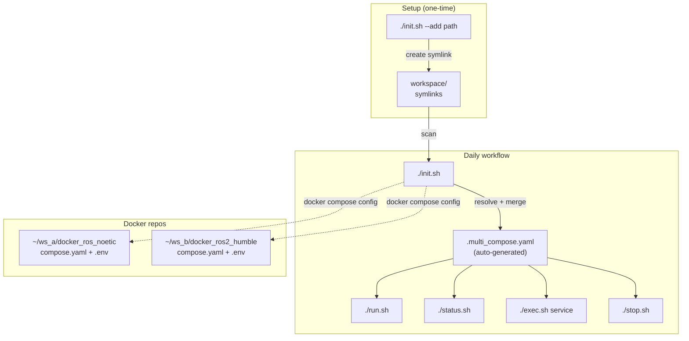

# multi_run

[](https://github.com/ycpss91255-docker/multi_run/actions/workflows/self-test.yaml)


[](./LICENSE)

Launch multiple Docker containers from different workspace simultaneously.

**[English](README.md)** | **[繁體中文](doc/readme/README.zh-TW.md)** | **[简体中文](doc/readme/README.zh-CN.md)** | **[日本語](doc/readme/README.ja.md)**

---

## Table of Contents

- [TL;DR](#tldr)
- [Overview](#overview)
- [Prerequisites](#prerequisites)
- [Getting Started](#getting-started)
- [Two Modes](#two-modes)
- [Architecture](#architecture)
- [Scripts Reference](#scripts-reference)
- [Supported Scenarios](#supported-scenarios)
- [How It Works (Technical)](#how-it-works-technical)
- [Running Tests](#running-tests)
- [Directory Structure](#directory-structure)

---

## TL;DR

```bash
./init.sh --add ~/robot_ws/docker_ros_noetic
./init.sh --add ~/nav_ws/docker_ros2_humble
./init.sh && ./run.sh       # start all
./stop.sh                   # stop all
```

## Overview

When working with multiple ROS workspace or Docker environments, you often need to run several containers at the same time (e.g., a ROS Noetic container for one robot and a ROS 2 Humble container for another). Normally you'd have to open multiple terminals, `cd` into each repo, and run `./run.sh` manually.

**multi_run** solves this by managing all your Docker workspace in one place. It merges multiple `compose.yaml` files into a single file with unique service names, so you can start, stop, and manage all containers with simple commands.

Works with any [docker_template](https://github.com/ycpss91255-docker/docker_template)-based repo.

## Prerequisites

- Docker + Docker Compose v2
- Python 3 with `pyyaml` (`pip install pyyaml`)
- Docker repos built with [docker_template](https://github.com/ycpss91255-docker/docker_template) (each must have `compose.yaml` + `.env`)

## Getting Started

### 1. Clone multi_run

```bash
cd ~/Desktop/docker   # or wherever you keep your Docker repos
git clone git@github.com:ycpss91255-docker/multi_run.git
cd multi_run
```

### 2. Register your workspace

Suppose you have two workspace:
```
~/robot_a_ws/docker_ros_noetic/     ← ROS 1 Noetic environment
~/robot_b_ws/docker_ros2_humble/    ← ROS 2 Humble environment
```

Register them:
```bash
./init.sh --add ~/robot_a_ws/docker_ros_noetic
# [multi] Added: docker_ros_noetic → /home/user/robot_a_ws/docker_ros_noetic

./init.sh --add ~/robot_b_ws/docker_ros2_humble
# [multi] Added: docker_ros2_humble → /home/user/robot_b_ws/docker_ros2_humble
```

This creates symlinks in `workspace/`:
```
workspace/
├── docker_ros_noetic → ~/robot_a_ws/docker_ros_noetic
└── docker_ros2_humble → ~/robot_b_ws/docker_ros2_humble
```

### 3. Initialize (generate merged compose)

```bash
./init.sh
# [multi] Added: docker_ros_noetic → ros_noetic_2a8b
# [multi] Added: docker_ros2_humble → ros2_humble_3c9d
# [multi] Generated: .multi_compose.yaml
# [multi] Run ./run.sh to start.
```

What happens:
1. Scans `workspace/` for all symlinks
2. Runs `docker compose config` on each repo to resolve all `.env` variables
3. Renames `devel` service to a unique ID (e.g., `ros_noetic_2a8b`) using image name + path hash
4. Merges everything into `.multi_compose.yaml`

### 4. Start all containers

```bash
./run.sh
# [multi] Starting containers...
#  Container multi_run-ros_noetic_2a8b-1 Started
#  Container multi_run-ros2_humble_3c9d-1 Started
# [multi] All containers started.
```

### 5. Check status

```bash
./status.sh
# [multi] Active workspace:
# [multi]   - /home/user/robot_a_ws/docker_ros_noetic
# [multi]   - /home/user/robot_b_ws/docker_ros2_humble
#
# NAME                              IMAGE                       STATUS
# multi_run-ros_noetic_2a8b-1       user/ros_noetic:devel       Up 30 seconds
# multi_run-ros2_humble_3c9d-1      user/ros2_humble:devel      Up 30 seconds
```

### 6. Enter a container

Use the service name from `./status.sh`:
```bash
./exec.sh ros_noetic_2a8b          # enter with bash
./exec.sh ros_noetic_2a8b htop     # run a command
```

### 7. Stop all

```bash
./stop.sh
# [multi] Stopping containers...
#  Container multi_run-ros_noetic_2a8b-1 Stopped
#  Container multi_run-ros2_humble_3c9d-1 Stopped
# [multi] All containers stopped.
```

## Two Modes

### Mode 1: Workspace symlinks (recommended for daily use)

Register workspace once, then `./init.sh && ./run.sh` every time.

```bash
# One-time setup
./init.sh --add ~/robot_a_ws/docker_ros_noetic
./init.sh --add ~/robot_b_ws/docker_ros2_humble

# Daily workflow
./init.sh && ./run.sh    # start
./stop.sh                # stop
```

**Advantage**: Workspaces are saved. No need to type paths every time.

### Mode 2: Direct paths (for one-off use)

Specify paths directly without saving to `workspace/`.

```bash
./init.sh ~/robot_a_ws/docker_ros_noetic ~/robot_b_ws/docker_ros2_humble
./run.sh
```

**Advantage**: Quick and temporary. Does not modify `workspace/`.

## Architecture



## Scripts Reference

| Script | Usage | Description |
|--------|-------|-------------|
| `init.sh --add <path>` | `./init.sh --add ~/ws/docker_ros_noetic` | Register a workspace (symlink in `workspace/`) |
| `init.sh --remove <name>` | `./init.sh --remove docker_ros_noetic` | Unregister a workspace |
| `init.sh --list` | `./init.sh --list` | List registered workspace |
| `init.sh [path...]` | `./init.sh` or `./init.sh path1 path2` | Generate `.multi_compose.yaml` |
| `run.sh` | `./run.sh` | Start all containers |
| `stop.sh` | `./stop.sh` | Stop and remove all containers |
| `exec.sh <svc> [cmd]` | `./exec.sh ros_noetic_2a8b` | Enter a container (default: bash) |
| `status.sh` | `./status.sh` | Show running containers |

All scripts support `-h` / `--help`.

## Supported Scenarios

| Scenario | Example | Status |
|----------|---------|--------|
| Different workspace, different repos | `~/ws_a/docker_ros_noetic` + `~/ws_b/docker_ros2_humble` | Tested |
| Same workspace, different repos | `~/ws/osrf_ros_noetic` + `~/ws/osrf_ros2_humble` | Tested |
| Different workspace, same repo | `~/ws_a/docker_ros_noetic` + `~/ws_b/docker_ros_noetic` | Tested |

Same repo from different workspace works because each instance gets a unique service name based on path hash (e.g., `ros_noetic_2a8b` vs `ros_noetic_0529`).

## How It Works (Technical)

1. **`init.sh --add`** creates a symlink: `workspace/<name> → /absolute/path/to/repo`

2. **`init.sh`** (no args or with paths) for each workspace:
   - Runs `docker compose --env-file .env config` to fully resolve all `${VAR}` references
   - Uses Python to extract the `devel` service, remove `container_name`, and rename to `{IMAGE_NAME}_{hash}`
   - Appends to `.multi_compose.yaml`

3. **`run.sh`** / **`stop.sh`** / **`exec.sh`** / **`status.sh`** simply call `docker compose -f .multi_compose.yaml <command>`

The path hash (`_2a8b`) is the first 4 characters of the MD5 hash of the absolute path, ensuring same-repo-different-workspace instances get different names.

## Running Tests

```bash
make test     # ShellCheck + Bats (via docker compose)
make lint     # ShellCheck only
make clean    # Remove generated files
make help     # Show all targets
```

## Directory Structure

```
multi_run/
├── init.sh                    # Workspace management + generate merged compose
├── run.sh                     # Start containers
├── exec.sh                    # Exec into container
├── stop.sh                    # Stop containers
├── status.sh                  # Show status
├── workspace/                 # Symlinks to Docker repos
├── Makefile                   # Command entry
├── compose.yaml               # CI runner
├── script/
│   ├── lib.sh                 # Shared functions
│   ├── ci.sh                  # CI pipeline
│   └── resolve_compose.py     # Compose YAML merge tool
├── test/
│   ├── multi_run_spec.bats    # Bats tests
│   ├── test_helper.bash
│   └── test_resolve_compose.py # Python tests
├── doc/
│   ├── readme/                # README translations
│   ├── test/                  # TEST.md + translations
│   └── changelog/             # CHANGELOG.md + translations
├── template/                  # git subtree (test-only, v0.8.1)
├── .template_version
├── .github/workflows/
│   └── self-test.yaml
├── .codecov.yaml
├── .gitignore
├── LICENSE
└── README.md
```

> `template/` is included as a git subtree **for testing only** — multi_run's
> runtime scripts do not depend on it. The E2E test uses `template/init.sh` to
> scaffold a realistic template-based repo fixture in DinD, then exercises
> multi_run against that fixture.

