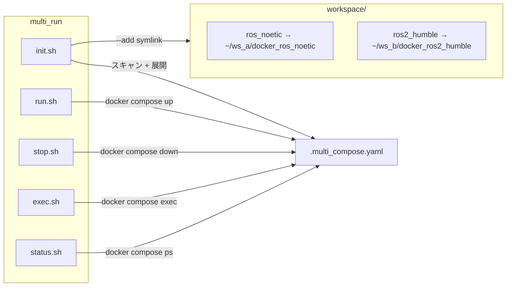

# multi_run

[](https://github.com/ycpss91255-docker/multi_run/actions/workflows/self-test.yaml)


[](./LICENSE)

複数のワークスペースの Docker コンテナを同時に起動。

**[English](../../README.md)** | **[繁體中文](README.zh-TW.md)** | **[简体中文](README.zh-CN.md)** | **[日本語](README.ja.md)**

---

## 目次

- [TL;DR](#tldr)
- [概要](#概要)
- [スクリプト](#スクリプト)
- [テスト](#テスト)

---

## TL;DR

```bash
# ワークスペースを追加
./init.sh --add ~/robot_ws/docker_ros_noetic
./init.sh --add ~/nav_ws/docker_ros2_humble

# 初期化 + 起動
./init.sh && ./run.sh

# 停止
./stop.sh
```

## 概要

複数の [docker_template](https://github.com/ycpss91255-docker/docker_template) コンテナを一括管理。各ワークスペースの `compose.yaml` を展開・統合し、ユニークなサービス名で競合を回避。

### アーキテクチャ



## スクリプト

| スクリプト | 説明 |
|-----------|------|
| `init.sh --add <path>` | ワークスペースを追加（`workspace/` に symlink 作成） |
| `init.sh --remove <name>` | ワークスペースを削除 |
| `init.sh --list` | 登録済みワークスペースを表示 |
| `init.sh [path...]` | workspace またはパスから `.multi_compose.yaml` を生成 |
| `run.sh` | 全コンテナ起動 |
| `stop.sh` | 全コンテナ停止 |
| `exec.sh <service>` | コンテナに接続 |
| `status.sh` | ステータス表示 |

## テスト

[TEST.md](../test/TEST.md) を参照。

