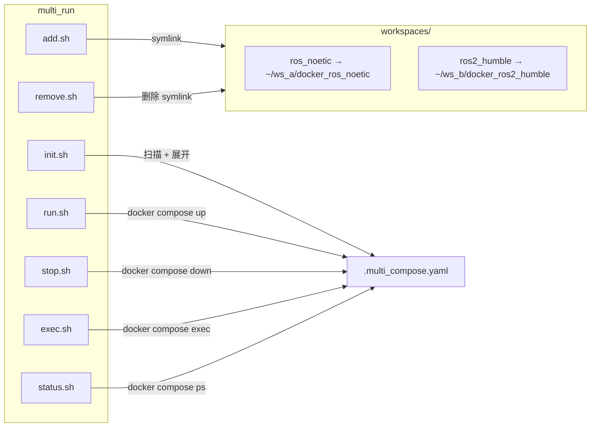

# multi_run

[](https://github.com/ycpss91255-docker/multi_run/actions/workflows/self-test.yaml)


[](./LICENSE)

同时启动多个不同工作区的 Docker 容器。

[English](../../README.md) | [繁體中文](README.zh-TW.md) | [日本語](README.ja.md)

## TL;DR

```bash
# 添加工作区
./add.sh ~/robot_ws/docker_ros_noetic
./add.sh ~/nav_ws/docker_ros2_humble

# 初始化 + 启动
./init.sh && ./run.sh

# 停止
./stop.sh
```

## 概述

管理多个 [docker_template](https://github.com/ycpss91255-docker/docker_template) 容器。各工作区的 `compose.yaml` 会被展开并合并成一个 compose 文件，使用唯一 service name 避免冲突。

### 架构



## 脚本

| 脚本 | 说明 |
|------|------|
| `add.sh <path>` | 添加工作区（在 `workspaces/` 创建 symlink） |
| `remove.sh <name>` | 移除工作区 |
| `init.sh [path...]` | 从 workspaces 或指定路径生成 `.multi_compose.yaml` |
| `run.sh` | 启动所有容器 |
| `stop.sh` | 停止所有容器 |
| `exec.sh <service>` | 进入容器 |
| `status.sh` | 显示容器状态 |

## 测试

详见 [TEST.md](../test/TEST.md)。

## 变更记录

详见 [CHANGELOG.md](../changelog/CHANGELOG.md)。
