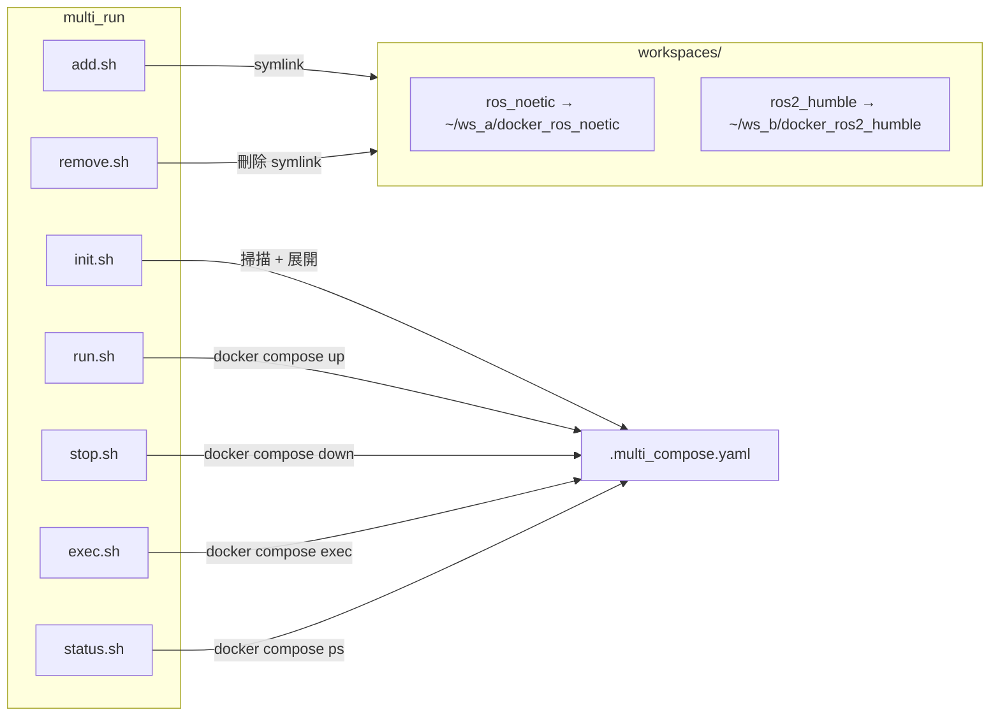

# multi_run

[](https://github.com/ycpss91255-docker/multi_run/actions/workflows/self-test.yaml)


[](./LICENSE)

同時啟動多個不同工作區的 Docker 容器。

[English](../../README.md) | [简体中文](README.zh-CN.md) | [日本語](README.ja.md)

## TL;DR

```bash
# 加入工作區
./add.sh ~/robot_ws/docker_ros_noetic
./add.sh ~/nav_ws/docker_ros2_humble

# 初始化 + 啟動
./init.sh && ./run.sh

# 停止
./stop.sh
```

## 概述

管理多個 [docker_template](https://github.com/ycpss91255-docker/docker_template) 容器。各工作區的 `compose.yaml` 會被展開並合併成一個 compose 檔案，使用唯一 service name 避免衝突。

### 架構



## 腳本

| 腳本 | 說明 |
|------|------|
| `add.sh <path>` | 加入工作區（在 `workspaces/` 建立 symlink） |
| `remove.sh <name>` | 移除工作區 |
| `init.sh [path...]` | 從 workspaces 或指定路徑生成 `.multi_compose.yaml` |
| `run.sh` | 啟動所有容器 |
| `stop.sh` | 停止所有容器 |
| `exec.sh <service>` | 進入容器 |
| `status.sh` | 顯示容器狀態 |

## 使用方式

### 模式 1：Workspace symlinks

```bash
./add.sh ~/robot_ws/docker_ros_noetic
./add.sh ~/nav_ws/docker_ros2_humble
./init.sh && ./run.sh
./status.sh
./exec.sh ros_noetic_2a8b
./stop.sh
```

### 模式 2：直接指定路徑

```bash
./init.sh ~/robot_ws/docker_ros_noetic ~/nav_ws/docker_ros2_humble
./run.sh
```

## 測試

詳見 [TEST.md](../test/TEST.md)。

## 變更記錄

詳見 [CHANGELOG.md](../changelog/CHANGELOG.md)。
