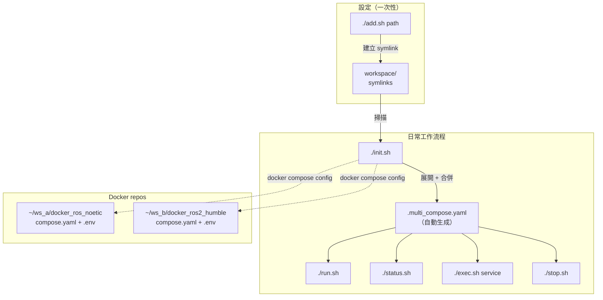

# multi_run

[](https://github.com/ycpss91255-docker/multi_run/actions/workflows/self-test.yaml)


[](./LICENSE)

同時啟動多個不同工作區的 Docker 容器。

**[English](../../README.md)** | **[繁體中文](README.zh-TW.md)** | **[简体中文](README.zh-CN.md)** | **[日本語](README.ja.md)**

## TL;DR

```bash
./add.sh ~/robot_ws/docker_ros_noetic
./add.sh ~/nav_ws/docker_ros2_humble
./init.sh && ./run.sh       # 啟動全部
./stop.sh                   # 停止全部
```

## 概述

在同時開發多個 ROS 工作區或 Docker 環境時，經常需要同時執行多個容器（例如一台機器人用 ROS Noetic，另一台用 ROS 2 Humble）。通常你得開多個終端機，分別 `cd` 到各 repo 手動執行 `./run.sh`。

**multi_run** 將所有 Docker 工作區集中管理。它把多個 `compose.yaml` 合併成一個檔案，並使用唯一的 service name，讓你用簡單的指令啟動、停止和管理所有容器。

適用於任何 [docker_template](https://github.com/ycpss91255-docker/docker_template) 為基礎的 repo。

## 前置需求

- Docker + Docker Compose v2
- Python 3 + `pyyaml`（`pip install pyyaml`）
- 以 [docker_template](https://github.com/ycpss91255-docker/docker_template) 建置的 Docker repo（需有 `compose.yaml` + `.env`）

## 快速開始

### 1. Clone multi_run

```bash
cd ~/Desktop/docker   # 或你放 Docker repo 的位置
git clone git@github.com:ycpss91255-docker/multi_run.git
cd multi_run
```

### 2. 註冊工作區

假設你有兩個工作區：
```
~/robot_a_ws/docker_ros_noetic/     ← ROS 1 Noetic 環境
~/robot_b_ws/docker_ros2_humble/    ← ROS 2 Humble 環境
```

註冊它們：
```bash
./add.sh ~/robot_a_ws/docker_ros_noetic
# [multi] Added: docker_ros_noetic → /home/user/robot_a_ws/docker_ros_noetic

./add.sh ~/robot_b_ws/docker_ros2_humble
# [multi] Added: docker_ros2_humble → /home/user/robot_b_ws/docker_ros2_humble
```

這會在 `workspace/` 建立 symlink：
```
workspace/
├── docker_ros_noetic → ~/robot_a_ws/docker_ros_noetic
└── docker_ros2_humble → ~/robot_b_ws/docker_ros2_humble
```

### 3. 初始化（生成合併的 compose）

```bash
./init.sh
# [multi] Added: docker_ros_noetic → ros_noetic_2a8b
# [multi] Added: docker_ros2_humble → ros2_humble_3c9d
# [multi] Generated: .multi_compose.yaml
# [multi] Run ./run.sh to start.
```

它做了什麼：
1. 掃描 `workspace/` 裡所有 symlink
2. 對每個 repo 執行 `docker compose config`（展開所有 `.env` 變數）
3. 將 `devel` service 改名為唯一 ID（如 `ros_noetic_2a8b`，由映像名 + 路徑 hash 組成）
4. 合併成一個 `.multi_compose.yaml`

### 4. 啟動所有容器

```bash
./run.sh
# [multi] Starting containers...
#  Container multi_run-ros_noetic_2a8b-1 Started
#  Container multi_run-ros2_humble_3c9d-1 Started
# [multi] All containers started.
```

### 5. 查看狀態

```bash
./status.sh
# [multi] Active workspace:
# [multi]   - /home/user/robot_a_ws/docker_ros_noetic
# [multi]   - /home/user/robot_b_ws/docker_ros2_humble
#
# NAME                              IMAGE                       STATUS
# multi_run-ros_noetic_2a8b-1       user/ros_noetic:devel       Up 30 seconds
# multi_run-ros2_humble_3c9d-1      user/ros2_humble:devel      Up 30 seconds
```

### 6. 進入容器

使用 `./status.sh` 顯示的 service name：
```bash
./exec.sh ros_noetic_2a8b          # 以 bash 進入
./exec.sh ros_noetic_2a8b htop     # 執行指令
```

### 7. 停止全部

```bash
./stop.sh
# [multi] Stopping containers...
#  Container multi_run-ros_noetic_2a8b-1 Stopped
#  Container multi_run-ros2_humble_3c9d-1 Stopped
# [multi] All containers stopped.
```

## 兩種模式

### 模式 1：Workspace symlinks（推薦日常使用）

註冊一次工作區，之後每次只要 `./init.sh && ./run.sh`。

```bash
# 一次性設定
./add.sh ~/robot_a_ws/docker_ros_noetic
./add.sh ~/robot_b_ws/docker_ros2_humble

# 日常工作流程
./init.sh && ./run.sh    # 啟動
./stop.sh                # 停止
```

**優點**：工作區已儲存，不需要每次重新輸入路徑。

### 模式 2：直接指定路徑（臨時使用）

直接指定路徑，不儲存到 `workspace/`。

```bash
./init.sh ~/robot_a_ws/docker_ros_noetic ~/robot_b_ws/docker_ros2_humble
./run.sh
```

**優點**：快速且臨時，不修改 `workspace/`。

## 架構



## 腳本參考

| 腳本 | 用法 | 說明 |
|------|------|------|
| `add.sh <path>` | `./add.sh ~/ws/docker_ros_noetic` | 註冊工作區（`workspace/` 建立 symlink） |
| `remove.sh <name>` | `./remove.sh docker_ros_noetic` | 取消註冊工作區 |
| `init.sh [path...]` | `./init.sh` 或 `./init.sh path1 path2` | 生成 `.multi_compose.yaml` |
| `run.sh` | `./run.sh` | 啟動所有容器 |
| `stop.sh` | `./stop.sh` | 停止並移除所有容器 |
| `exec.sh <svc> [cmd]` | `./exec.sh ros_noetic_2a8b` | 進入容器（預設：bash） |
| `status.sh` | `./status.sh` | 顯示執行中的容器 |

所有腳本支援 `-h` / `--help`。

## 支援場景

| 場景 | 範例 | 狀態 |
|------|------|------|
| 不同工作區、不同 repo | `~/ws_a/docker_ros_noetic` + `~/ws_b/docker_ros2_humble` | 已測試 |
| 同工作區、不同 repo | `~/ws/osrf_ros_noetic` + `~/ws/osrf_ros2_humble` | 已測試 |
| 不同工作區、同 repo | `~/ws_a/docker_ros_noetic` + `~/ws_b/docker_ros_noetic` | 已測試 |

同 repo 不同工作區可以同時執行，因為每個 instance 會根據路徑 hash 產生唯一的 service name（如 `ros_noetic_2a8b` vs `ros_noetic_0529`）。

## 運作原理（技術細節）

1. **`add.sh`** 建立 symlink：`workspace/<name> → /absolute/path/to/repo`

2. **`init.sh`** 對每個工作區：
   - 執行 `docker compose --env-file .env config` 完全展開所有 `${VAR}` 引用
   - 使用 Python 提取 `devel` service，移除 `container_name`，重命名為 `{IMAGE_NAME}_{hash}`
   - 附加到 `.multi_compose.yaml`

3. **`run.sh`** / **`stop.sh`** / **`exec.sh`** / **`status.sh`** 直接呼叫 `docker compose -f .multi_compose.yaml <command>`

路徑 hash（`_2a8b`）是絕對路徑 MD5 hash 的前 4 字元，確保同 repo 不同工作區的 instance 有不同的名稱。

## 執行測試

```bash
make test     # ShellCheck + Bats（透過 docker compose）
make lint     # 只跑 ShellCheck
make clean    # 移除生成的檔案
make help     # 顯示所有可用指令
```

## 目錄結構

```
multi_run/
├── init.sh                    # 生成合併 compose
├── run.sh                     # 啟動容器
├── exec.sh                    # 進入容器
├── stop.sh                    # 停止容器
├── status.sh                  # 顯示狀態
├── add.sh                     # 加入工作區
├── remove.sh                  # 移除工作區
├── lib.sh                     # 共用函式
├── workspace/                # Docker repo 的 symlinks
├── Makefile                   # 指令入口
├── compose.yaml               # CI 執行器
├── script/
│   └── ci.sh                  # CI pipeline
├── test/
│   ├── multi_run_spec.bats
│   └── test_helper.bash
├── doc/
│   ├── readme/                # README 翻譯
│   ├── test/                  # TEST.md + 翻譯
│   └── changelog/             # CHANGELOG.md + 翻譯
├── .github/workflows/
│   └── self-test.yaml
├── .codecov.yaml
├── .gitignore
├── LICENSE
└── README.md
```

## 變更記錄

詳見 [CHANGELOG.md](../changelog/CHANGELOG.md)。

## 測試

詳見 [TEST.md](../test/TEST.md)。
